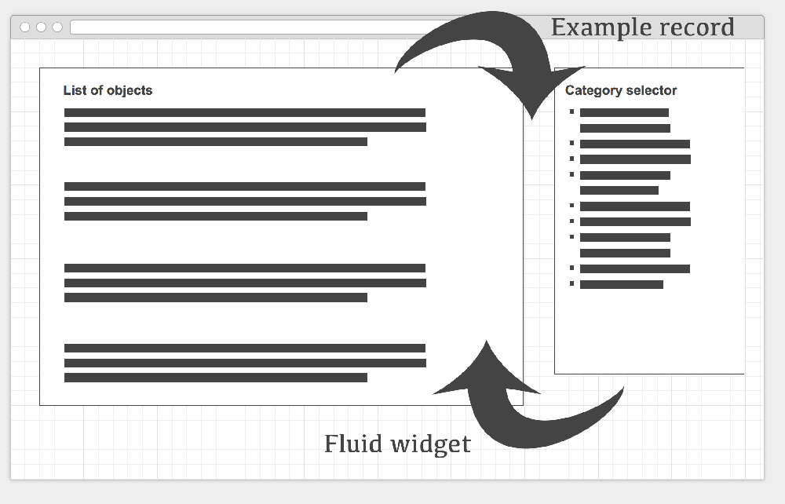
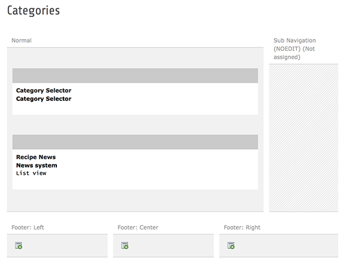
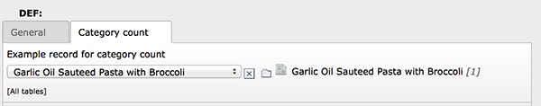

.. ==================================================
.. FOR YOUR INFORMATION
.. --------------------------------------------------
.. -*- coding: utf-8 -*- with BOM.

.. include:: ../Includes.txt

Integrator Manual
=================

Object context
^^^^^^^^^^^^^^

Categories and filter options are normally implemented in the context of particular object lists. The generic nature
of the category selector makes it possible to use it with any extbase based list of objects. Before we can use it, this
means that we have to tell each plugin instance what the particular object context it is used in is.

Have a look at this graphic:

	Object list and category selector need to "know" of each other

A list of objects (most likely created by another plugin/extension) needs to know which categories of the category selector
have been clicked to filter out the objects that belong to the respective categories. The connection between the object list
and the selector is done with a Fluid widget. The category selector on the other hand needs to know which objects it is used for,
otherwise it could not display a category count. This connection is done by setting an example object in the plugin configuration
of the category selector.

Steps to integrate
^^^^^^^^^^^^^^^^^^

1. Setup the category selector
------------------------------

Go to the page with the list plugin of your objects. Insert a category selector plugin on this page. Select the categories
your would like to start the tree from and set how many levels of child categories you would like to display.

	Example category selector used together with the news extension

2. Insert the example object
----------------------------

Next go to the second tab and set an example record from your object list in the according field. This is necessary for the
category selector to be able to calculate the object count for each category.

	Example news set in the according field of the category selector

You can also set some pids as limitation for the category count. Finally, you can decide what happens with categories that have
no items. The standard behaviour is not to display categories without items in the tree. If you check the according checkbox,
categories with no items will also be displayed in the tree.

3. Insert the widget in your list template
------------------------------------------

Now go to the Fluid template for your object list. First of all, add the category selector namespace to the top of your
template:

.. code-block:: html

	{namespace c=ADWLM\CategorySelector\ViewHelpers}

There will very likely be a f:for loop that iterates through the objects of the list. Wrap the category selector
widget around it. Here is an example for the news extension:

.. code-block:: html

	<c:widget.categoryfilter objects="{news}" as="categorizedNews" configuration="{propertyName : 'categories', displaySelectedCategoryNames : 1}">
		<n:widget.paginate objects="{categorizedNews}" as="paginatedNews" configuration="{settings.list.paginate}" initial="{offset:settings.offset,limit:settings.limit}">
			<f:for each="{paginatedNews}" as="newsItem" iteration="iterator">
				<f:render partial="List/Item" arguments="{newsItem: newsItem,settings:settings,iterator:iterator}" />
			</f:for>
		</n:widget.paginate>
	</c:widget.categoryfilter>

One thing is important: The configuration option "propertyName" of the widget must match the name of the category field in TCA.
Normally, this should be "categories". In case another name is used, don't forget to adapt it in the widget configuration. You can
find out how the sys_category field for a given table is named by using the System > Configuration module in the backend.

Finished. Your list of objects should now be filterable by categories.