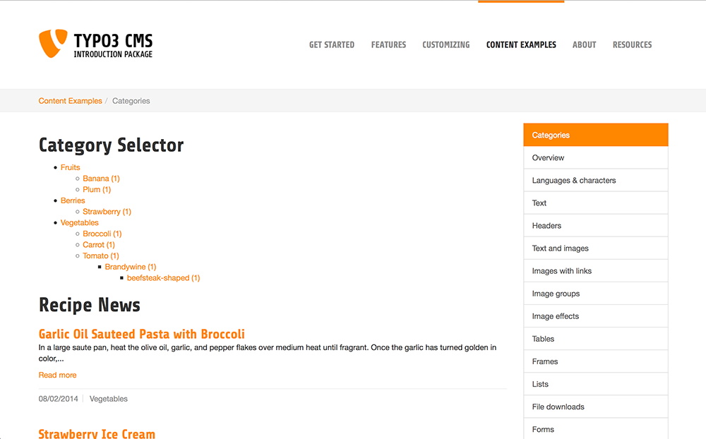
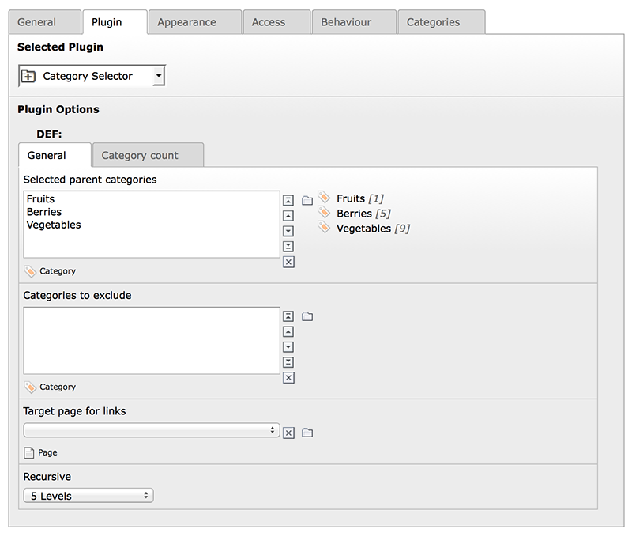
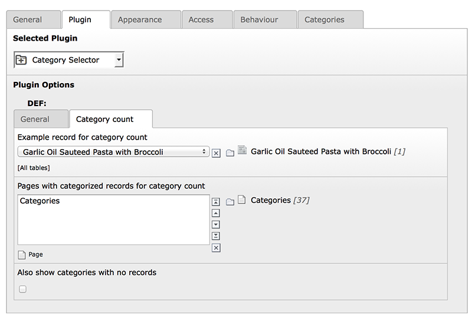

.. ==================================================
.. FOR YOUR INFORMATION
.. --------------------------------------------------
.. -*- coding: utf-8 -*- with BOM.

.. include:: ../Includes.txt

Introduction
============

What does it do?
^^^^^^^^^^^^^^^^

This extension provides a generic category selector for lists of objects that are based on extbase/fluid and sys_category.
You can display a configurable category tree with object count and use it for filtering a given list of objects. The category
selector can be used with your own extbase extension or any third party extension from TER.

Features
^^^^^^^^

- flexible starting points

- possibility to exclude certain categories

- recursion to a specified category level

- AND based selection of multiple categories

- dynamic object count based on selected categories

- dynamic tree display based on selected categories

- widget for filtering a list of objects by selected categories

Screenshots
^^^^^^^^^^^

	An example category selector used together with the tx_news extension (6.2 introduction package).

	Basic plugin settings of the category selector: starting points for the frontend tree, categories to exclude and level of
	recursion for the category tree.

	Plugin settings for the object count and the handling of categories with no items.

Credits
^^^^^^^

This extension is being developed by the `Digital Academy <http://www.digitale-akademie.de/>`_ of
the `Akademie der Wissenschaften und der Literatur | Mainz <http://www.adwmainz.de/>`_.
You can find us on `Twitter (@digicademy) <https://twitter.com/digicademy>`_ and take part in the development on
`GitHub <https://github.com/digicademy/category_selector>`_.

Credits for sponsoring go to the `Berlin Brandenburgische Akademie der Wissenschaften <http://www.bbaw.de/>`_ and `TELOTA <http://www.bbaw.de/telota/telota>`_.

The extension icon is from `Typicons <http://typicons.com/>`_ by `Stephen Hutchings <https://github.com/stephenhutchings/typicons.font>`_.