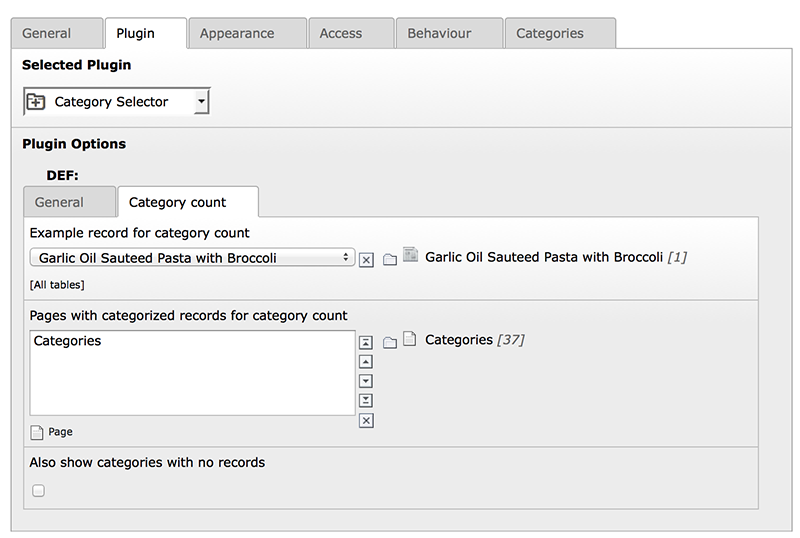

Category Selector
==================

This TYPO3 extension provides a generic category selector for lists of objects that are based on extbase/fluid and sys_category.
You can display a configurable category tree with object count and use it for filtering a given list of objects. The category
selector can be used with your own extbase extension or any third party extension from TER.

Check out the manual at: http://docs.typo3.org/typo3cms/extensions/category_selector/

## Features

* flexible starting points
* possibility to exclude certain categories
* recursion to a specified category level
* AND based selection of multiple categories
* dynamic object count based on selected categories
* dynamic tree display based on selected categories
* widget for filtering a list of objects by selected categories

## Screenshots

